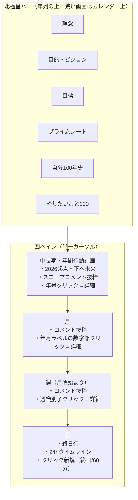
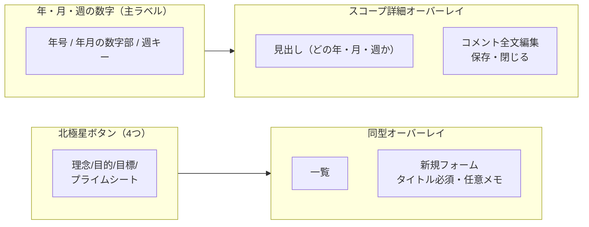
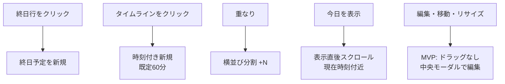
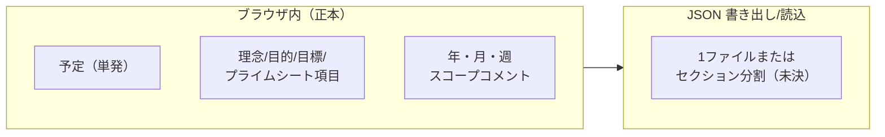
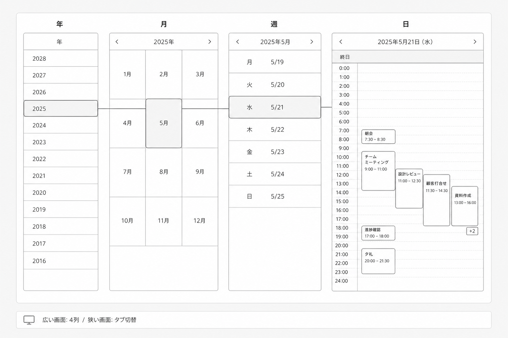
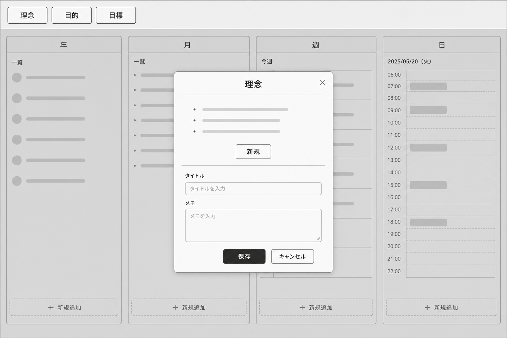
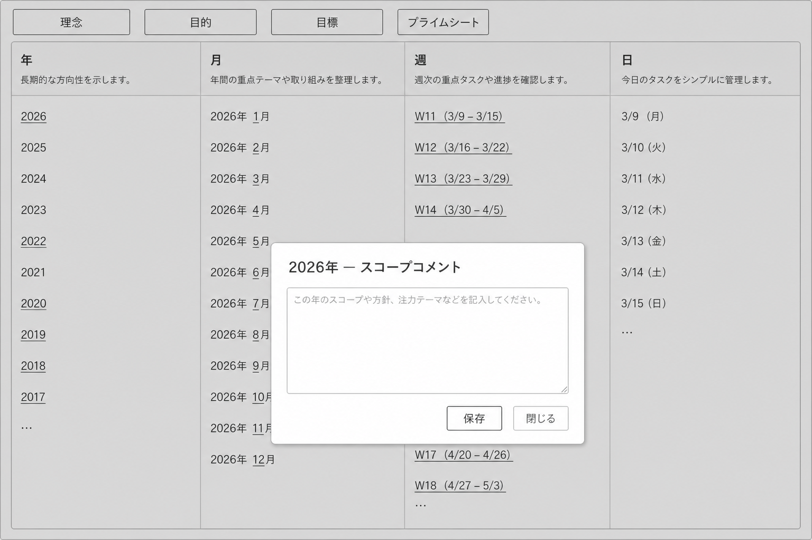
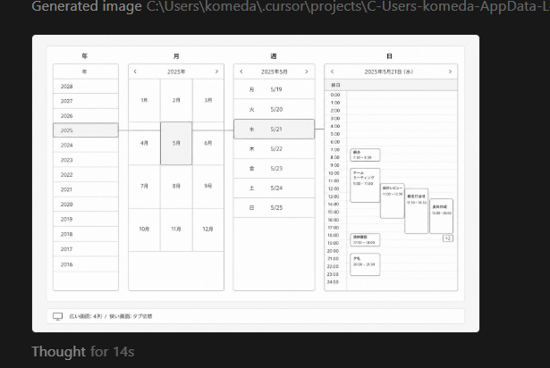
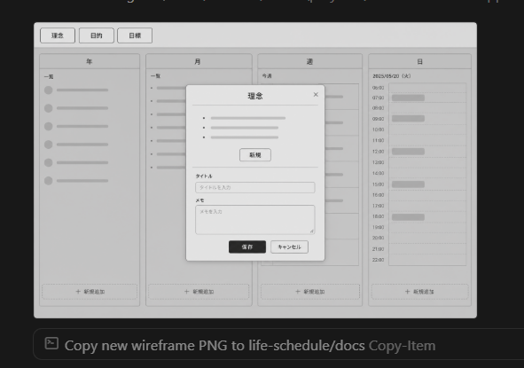
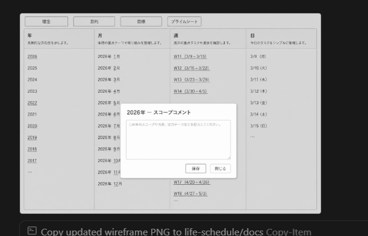

# 人生スケジュール — チャット内容・UI画像の図解

会話で合意した機能と、`docs` 内のワイヤー PNG の対応を一枚に整理したものです。

## 改善の設計図解（2026-05 追記）

チャットで悩みながら積み上げた改善内容を、画面モックと「悩み→改善」対応表にまとめた **HTML 図解** をリポジトリに同梱しています。

| 形式 | 場所 |
|------|------|
| 公開 URL | https://diagram-life-schedule-improvements.surge.sh/ |
| ローカル HTML | [`design-improvements-diagram.html`](design-improvements-diagram.html)（Surge と同一内容） |
| 画面・操作（旧） | https://diagram-life-schedule-tool.surge.sh/ |

ブラウザで HTML を開くか、上記 Surge URL を参照してください。

---

## 1. 画面レイアウト（情報構造）

---

## 2. クリックで開くオーバーレイ（2系統）

**役割分担（カーソルと衝突しないように）**

- **数字（主ラベル）クリック** → 右の「スコープ詳細」オーバーレイ。
- **行・セルの他領域クリック** → 単一カーソルのみ移動（実装でヒット領域を設計）。

---

## 3. 日ペインのルール（要約）

---

## 4. データ・永続化（MVP方針）

- 予定インポート: **ID upsert**。
- タイムゾーン: **ブラウザローカルのみ**。
- 狭い画面: **年/月/週/日タブ**、広いとき **四列**。

---

## 5. UIワイヤー PNG との対応

| ファイル | 図の役割 |
|----------|----------|
| `life-schedule-ui-wireframe.png` | 四ペイン + 終日/タイムラインの基本形。 |
| `life-schedule-ui-north-star-modal.png` | 旧: 北極星 **3ボタン** + モーダル（プライムシートなし）。 |
| `life-schedule-ui-north-star-4btns-scope-modal.png` | **4ボタン** + 年・月・週のコメント感 + **スコープコメント用モーダル**のラフ。 |

### 画像（同一フォルダの PNG をそのまま表示）

**絶対パス（このマシン）**

- `C:\Users\komeda\src\life-schedule\docs\life-schedule-ui-wireframe.png`
- `C:\Users\komeda\src\life-schedule\docs\life-schedule-ui-north-star-modal.png`
- `C:\Users\komeda\src\life-schedule\docs\life-schedule-ui-north-star-4btns-scope-modal.png`

### スクリーンショット（実画面・参考）

- `C:\Users\komeda\src\life-schedule\docs\life-schedule-screenshot-4column-ui.png`
- `C:\Users\komeda\src\life-schedule\docs\life-schedule-screenshot-north-star-3btn-modal.png`
- `C:\Users\komeda\src\life-schedule\docs\life-schedule-screenshot-4btn-scope-comment.png`

---

## 6. 詳細仕様の全文

細かい表は **`design-spec-2026-05-14.md`** を参照してください。

`C:\Users\komeda\src\life-schedule\docs\design-spec-2026-05-14.md`
